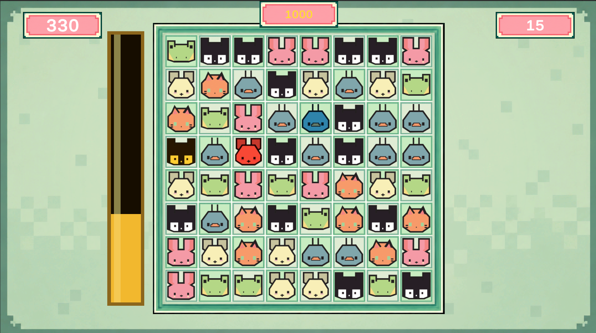

# Match3

A small match-3 game prototype built in Unity.

## Overview

This project is a playable match-3 foundation with swapping, matching, gravity, refills, cascades, score, move limit, and special pieces.

It currently includes **one playable scene**. There is **no menu, no level selection, and no multiple levels** yet, but the project is structured so it can be expanded into a larger game later.

## Current Features

- Match-3 board gameplay
- Score and move limit
- Cascades / chain reactions
- Special pieces:
  - horizontal line clear
  - vertical line clear
  - bomb clear
- Simple juice, particles, and sound
- Config-driven visuals and gameplay settings

## Controls

- **Mouse / drag input**
- Select a piece and swipe toward a neighboring tile to swap

## Special Piece Visuals

Special pieces are implemented and fully working in gameplay.

Right now they **do not use dedicated sprites**. Instead, specials are shown using **different colors/tints** so they are easy to identify during play.

It is possible to add custom sprites for:

- bombs
- line clears
- special effects
- particles / feedback elements

I just did not add those assets yet.

## Configuration

Most of the game can be adjusted through config assets.

### Main configs

- **LevelSettings**
  
  Gameplay values such as:
  - grid size
  - moves
  - target score
  - random seed
  - match rules
  - bomb radius
  - available colors

- **PieceSpriteConfig**
  
  Used to change the look of the characters / pieces.

- **BoardSpriteConfig**
  
  Used to change the look of the board, background, frame, and tiles.

These configs are the main place to tweak the game's look and feel without changing code.

## Scene

The project currently includes **one playable scene**:

- `Assets/Scenes/SampleScene.unity`

This is the main prototype scene and the current entry point for the game.

## Project Notes

This is a prototype / foundation project, not a full game yet.

What is already here:

- core board logic
- match detection
- special resolution
- refill / gravity system
- configurable presentation

What is not here yet:

- menu flow
- multiple levels
- progression
- win/lose flow beyond the current prototype setup
- dedicated art for specials

It should be straightforward to build more on top of it, and I may expand it further in the future.

## Tech

- **Unity**
- C#
- DOTween
- Unity Input System
